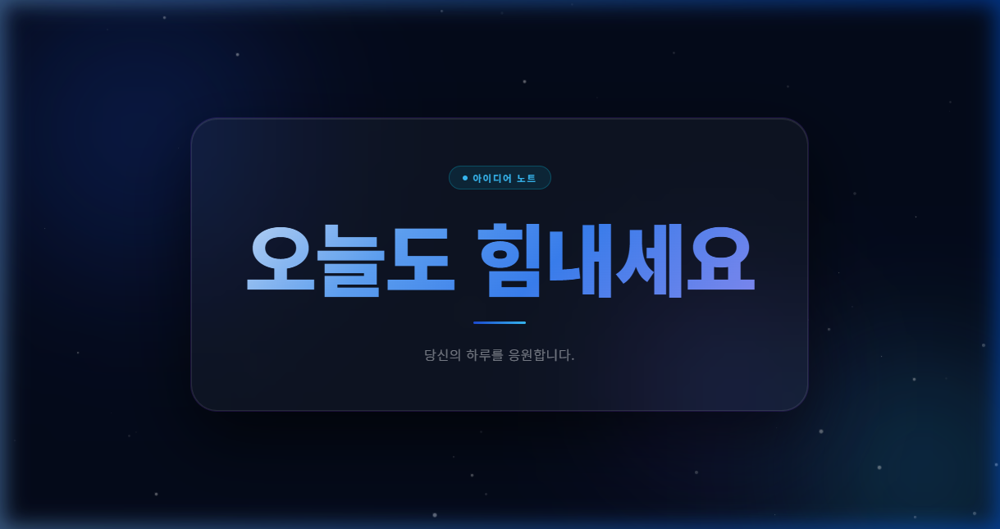
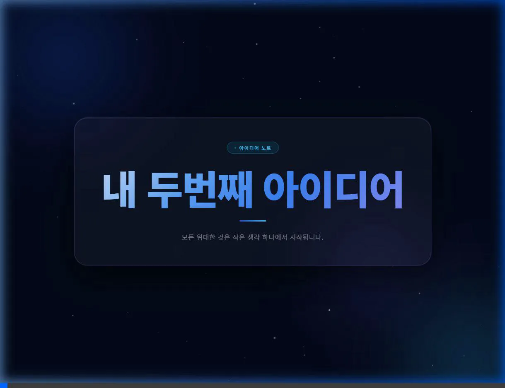
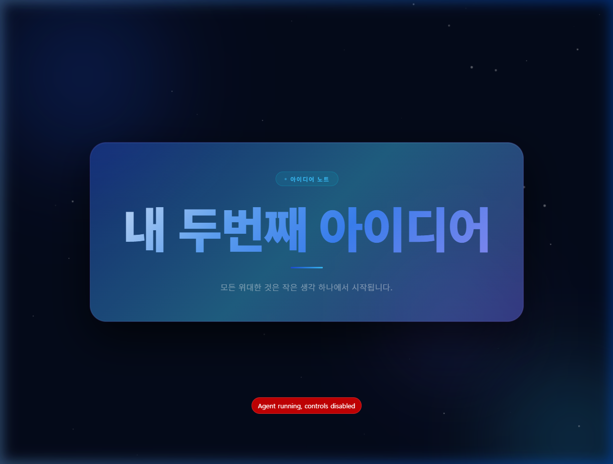

# 브라우저 실행 및 상호작용 검증 보고서 (로컬 복사본)

로컬 웹 서버(`http://localhost:8080`)를 가동하여 브라우저에서 작성된 웹페이지 코드를 직접 실행하고 디자인 및 상호작용 테스트를 진행했습니다.

## 1. 전체 레이아웃 및 디자인
- **어두운 밤하늘 배경**: 딥 블루-블랙 계열(`#040a1a`)의 세련된 배경색을 사용했습니다.
- **부유하는 빛의 구체 (Orbs)**: 배경 뒤쪽에서 로열 블루, 하늘색, 인디고 색상을 띤 3개의 부드러운 빛무리(Orb)가 서서히 위치와 스케일을 바꾸며 떠다닙니다.
- **반짝이는 별빛 파티클**: 자바스크립트로 생성된 55개의 하얀색 반투명 파티클 도트들이 제각기 다른 주기와 딜레이로 부드럽게 깜빡입니다.
- **글래스모피즘 카드**: 화면 중앙의 주요 콘텐츠 영역은 투명도가 가미된 배경과 반투명 테두리, 그리고 강력한 `backdrop-filter: blur(20px)` 효과를 적용하여 뒤쪽의 흐르는 배경이 비치도록 디자인되었습니다.

## 2. 텍스트 확인 (오늘도 힘내세요)
- 상단 배지에 "아이디어 노트"와 펄스 애니메이션이 가미된 파란 점이 보입니다.
- 메인 문구가 **"오늘도 힘내세요"**로 올바르게 표시됩니다.
- 텍스트에는 부드러운 그라데이션(하늘색 ➡️ 로열 블루 ➡️ 인디고)이 적용되어 고급스러운 질감을 연출합니다.
- 하단에는 **"당신의 하루를 응원합니다."**라는 얇은 폰트의 서브 타이틀이 배치되었습니다.

## 3. 상호작용 테스트 (호버 반응)
- **평상 시**: 깔끔하게 테두리 라인만 반짝이는 글래스 카드 형태입니다.
- **마우스 호버 시**: 마우스 커서를 카드 위에 올리면 카드 뒤편에 숨겨져 있던 파란색 계열의 광채(Glow) 링 효과가 `opacity 0`에서 `0.45`로 0.4초에 걸쳐 부드럽게 퍼져 나옵니다. 마우스를 밖으로 치우면 다시 원래대로 사라집니다.

---

## 4. 검증 미디어 자료 (상대 경로 참조)

````carousel

<!-- slide -->

<!-- slide -->

````
